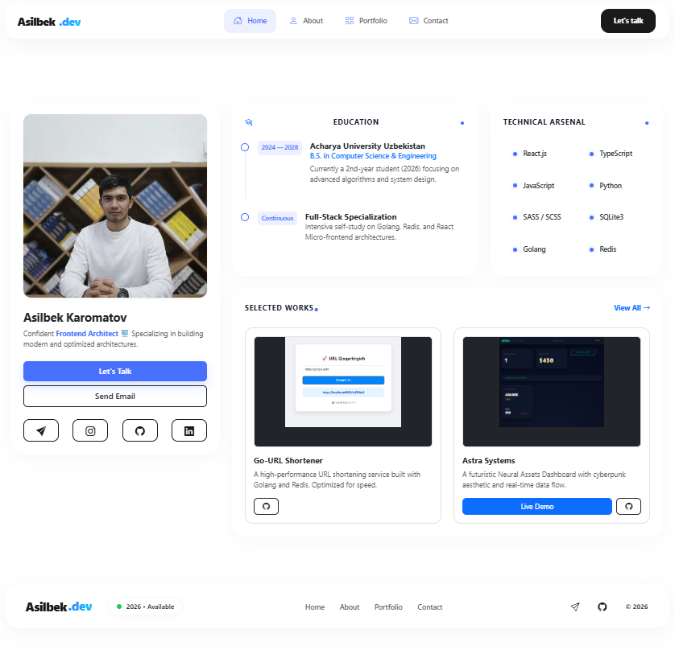
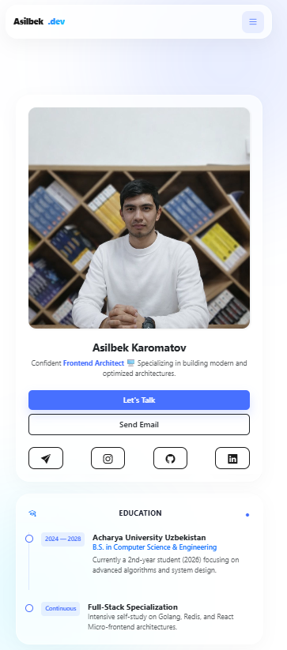

<div align="center">

# 🚀 Asilbek.dev | Modern Bento Portfolio

[](https://asilbek2706-github-io.vercel.app/)
[](https://reactjs.org/)
[](https://www.typescriptlang.org/)
[](https://vitejs.dev/)
[](https://sass-lang.com/)
[](https://opensource.org/licenses/MIT)

**A high-performance, responsive personal portfolio featuring a sleek Bento Grid layout**  
*Showcasing technical expertise with seamless Telegram integration*

[View Demo](https://asilbek2706-github-io.vercel.app/) • [Report Bug](https://github.com/Asilbek2706/asilbek2706.github.io/issues) • [Request Feature](https://github.com/Asilbek2706/asilbek2706.github.io/issues)

</div>

---

## 📋 Table of Contents

- [🌟 Overview](#-overview)
- [✨ Key Features](#-key-features)
- [🛠 Tech Stack](#-tech-stack)
- [🚀 Getting Started](#-getting-started)
  - [Prerequisites](#prerequisites)
  - [Installation](#installation)
  - [Environment Setup](#environment-setup)
  - [Running the Application](#running-the-application)
- [📁 Project Structure](#-project-structure)
- [📨 Telegram Integration](#-telegram-integration)
- [🎨 Customization](#-customization)
- [🚢 Deployment](#-deployment)
- [📸 Visual Preview](#-visual-preview)
- [🛠️ Available Scripts](#️-available-scripts)
- [🐛 Troubleshooting](#-troubleshooting)
- [🤝 Contributing](#-contributing)
- [🛡️ Security](#️-security)
- [📄 License](#-license)
- [👨‍💻 Connect](#-connect)

---

## 🌟 Overview

This is a modern, high-performance personal portfolio website built with **React 19** and **TypeScript**, featuring a beautiful **Bento Grid** layout inspired by Apple's design language. The project demonstrates best practices in web development, including secure API integration, smooth animations, and a fully responsive design that works flawlessly across all devices.

### Why This Portfolio?

- 🎯 **Modern Design**: Clean, minimalist interface with a contemporary Bento Grid layout
- ⚡ **Lightning Fast**: Built with Vite for optimal performance and instant hot module replacement
- 🔒 **Secure by Design**: Environment-based configuration with robust security practices
- 📱 **Mobile First**: Responsive design ensuring perfect display on any device
- 🎨 **Smooth Animations**: Engaging user experience with AOS scroll animations
- 📬 **Direct Communication**: Integrated Telegram bot for instant message notifications

---

## ✨ Key Features

| Feature | Description |
|---------|-------------|
| 🍱 **Bento Grid UI** | Modern, clean, and organized interface inspired by Apple's design language |
| 🤖 **Telegram Bot Integration** | Real-time message delivery from contact form directly to your Telegram |
| ⏳ **Premium Preloader** | Custom "Asilbek.dev" animated loading screen with navy-blue aesthetic |
| 🔐 **Secure Environment** | Robust protection of API credentials using environment variables |
| 🎭 **AOS Animations** | Smooth, scroll-triggered animations for an engaging user experience |
| 📱 **Fully Responsive** | Flawless experience across mobile, tablet, and desktop devices |
| 🎨 **SCSS Styling** | Modular and maintainable styles with SCSS preprocessor |
| ⚡ **React 19** | Latest React features with improved performance |
| 🔍 **SEO Optimized** | Proper meta tags and semantic HTML structure |
| 🌐 **SPA Architecture** | Single Page Application with React Router for smooth navigation |

---

## 🛠 Tech Stack

### Core Technologies

| Technology | Purpose | Version |
|-----------|---------|---------|
| ⚛️ **React** | UI Library | 19.2.0 |
| 📘 **TypeScript** | Type Safety | ~5.9.3 |
| ⚡ **Vite** | Build Tool & Dev Server | 7.2.4 |
| 🎨 **Sass/SCSS** | CSS Preprocessor | 1.97.3 |
| 📏 **Bootstrap 5** | CSS Framework | 5.3.8 |

### Key Dependencies

| Library | Purpose |
|---------|---------|
| 🎬 **AOS** | Animate On Scroll library for smooth animations |
| 🔄 **Axios** | HTTP client for API requests |
| 🧭 **React Router** | Client-side routing |
| 🎠 **Swiper** | Modern slider component |
| 📨 **Telegram Bot API** | Backend-less contact form integration |

### Development Tools

- 🔍 **ESLint** - Code linting and quality checks
- 📦 **gh-pages** - GitHub Pages deployment
- 🎯 **TypeScript ESLint** - TypeScript-specific linting rules

---

## 🚀 Getting Started

### Prerequisites

Before you begin, ensure you have the following installed:

- **Node.js** (v18.0 or higher) - [Download](https://nodejs.org/)
- **npm** (v9.0 or higher) - Comes with Node.js
- **Git** - [Download](https://git-scm.com/)

### Installation

1. **Clone the repository:**

```bash
git clone https://github.com/Asilbek2706/asilbek2706.github.io.git
cd asilbek2706.github.io
```

2. **Install dependencies:**

```bash
npm install
```

### Environment Setup

Create a `.env` file in the root directory and add your Telegram bot credentials:

```env
# Telegram Bot Configuration
VITE_TELEGRAM_BOT_TOKEN=your_bot_token_here
VITE_TELEGRAM_CHAT_ID=your_chat_id_here
```

#### How to get Telegram credentials:

1. **Create a Telegram Bot:**
   - Open Telegram and search for [@BotFather](https://t.me/botfather)
   - Send `/newbot` and follow the instructions
   - Copy the bot token provided

2. **Get your Chat ID:**
   - Search for [@userinfobot](https://t.me/userinfobot) on Telegram
   - Start the chat and it will send you your Chat ID
   - Copy the Chat ID number

### Running the Application

Start the development server:

```bash
npm run dev
```

The application will open at `http://localhost:5173` (default Vite port)

---

## 📁 Project Structure

```
asilbek2706.github.io/
├── 📂 public/              # Static assets
├── 📂 src/
│   ├── 📂 assets/          # Images, fonts, and other assets
│   │   └── 📂 images/      # Image files including favicon
│   ├── 📂 components/      # React components
│   │   ├── 📂 About/       # About section component
│   │   ├── 📂 Contact/     # Contact form with Telegram integration
│   │   ├── 📂 Education/   # Education section
│   │   ├── 📂 Footer/      # Footer component
│   │   ├── 📂 Navbar/      # Navigation bar
│   │   ├── 📂 Portfolio/   # Portfolio showcase
│   │   ├── 📂 Preloader/   # Loading animation
│   │   ├── 📂 ProfileCard/ # Main profile card
│   │   ├── 📂 Projects/    # Projects section
│   │   └── 📂 Skills/      # Skills showcase
│   ├── 📄 App.tsx          # Main application component
│   ├── 📄 App.scss         # Global styles
│   ├── 📄 main.tsx         # Application entry point
│   └── 📄 index.css        # Base CSS styles
├── 📂 backend/             # Backend-related files (if any)
├── 📄 index.html           # HTML entry point
├── 📄 vite.config.ts       # Vite configuration
├── 📄 tsconfig.json        # TypeScript configuration
├── 📄 eslint.config.js     # ESLint configuration
├── 📄 package.json         # Project dependencies and scripts
├── 📄 .gitignore           # Git ignore rules
├── 📄 LICENSE              # MIT License
├── 📄 SECURITY.md          # Security policy
└── 📄 README.md            # This file
```

---

## 📨 Telegram Integration

The portfolio features a seamless contact form integrated with Telegram Bot API for instant message notifications.

### How it Works

1. **User Input** → Visitor fills in name, email, and message in the contact form
2. **Form Validation** → React handles state management and input validation
3. **API Request** → Asynchronous `POST` request sent to Telegram Bot API via Axios
4. **Instant Delivery** → Message appears immediately in your private Telegram chat

### Security Features

- 🔐 **Environment Variables**: API credentials stored securely in `.env`
- 🚫 **Git Ignored**: Sensitive files excluded via `.gitignore`
- ✅ **Input Validation**: Form validation before sending requests
- 🔒 **HTTPS Only**: All API calls made over secure connections

### User Experience

- 🔄 **Loading State**: Visual spinner during message transmission
- ✅ **Success Feedback**: Confirmation message on successful delivery
- ❌ **Error Handling**: Clear error messages for network issues
- 📱 **Responsive Design**: Works perfectly on all devices

---

## 🎨 Customization

### Personalizing the Portfolio

1. **Update Personal Information:**
   - Edit component files in `src/components/`
   - Modify content in `ProfileCard`, `About`, `Skills`, etc.

2. **Change Colors and Styles:**
   - Global styles: `src/App.scss`
   - Component-specific styles: `[ComponentName].scss` in each component folder
   - Bootstrap variables can be overridden in SCSS files

3. **Modify Projects and Skills:**
   - Update data in respective component files
   - Add/remove items from arrays in component state

4. **Customize Animations:**
   - AOS animation settings in `App.tsx`
   - Modify `duration`, `easing`, and other AOS options

---

## 🚢 Deployment

### Deploy to GitHub Pages

1. **Update package.json:**
   - Ensure `homepage` field is set correctly (if needed)

2. **Build and Deploy:**

```bash
npm run build
npm run deploy
```

### Deploy to Vercel (Recommended)

1. **Install Vercel CLI:**

```bash
npm install -g vercel
```

2. **Deploy:**

```bash
vercel
```

3. **Add Environment Variables:**
   - Go to your Vercel dashboard
   - Add `VITE_TELEGRAM_BOT_TOKEN` and `VITE_TELEGRAM_CHAT_ID`

### Deploy to Netlify

1. **Connect your repository to Netlify**
2. **Build settings:**
   - Build command: `npm run build`
   - Publish directory: `dist`
3. **Add environment variables** in Netlify dashboard

---

## 📸 Visual Preview

<div align="center">

### 🖥️ Desktop View



### 📱 Mobile View



</div>

---

## 🛠️ Available Scripts

| Command | Description |
|---------|-------------|
| `npm run dev` | Start development server with hot reload |
| `npm run build` | Build production-ready application |
| `npm run preview` | Preview production build locally |
| `npm run lint` | Run ESLint to check code quality |
| `npm run deploy` | Deploy to GitHub Pages |

### Build Output

The build process:
1. Runs TypeScript compiler (`tsc`)
2. Bundles with Vite
3. Outputs to `dist/` directory

---

## 🐛 Troubleshooting

### Common Issues

<details>
<summary><b>Port 5173 is already in use</b></summary>

**Solution:**
```bash
# Kill the process using port 5173
npx kill-port 5173

# Or specify a different port
npm run dev -- --port 3000
```
</details>

<details>
<summary><b>Telegram messages not sending</b></summary>

**Checklist:**
- ✅ Verify `.env` file exists in root directory
- ✅ Check bot token is correct (starts with numbers and contains `:`)
- ✅ Confirm chat ID is correct (numeric value)
- ✅ Ensure bot has been started (send `/start` to your bot)
- ✅ Check browser console for error messages
</details>

<details>
<summary><b>Module not found errors</b></summary>

**Solution:**
```bash
# Clear node_modules and reinstall
rm -rf node_modules package-lock.json
npm install
```
</details>

<details>
<summary><b>TypeScript errors</b></summary>

**Solution:**
```bash
# Check TypeScript configuration
npx tsc --noEmit

# Clear TypeScript cache
rm -rf node_modules/.cache
```
</details>

<details>
<summary><b>Build fails on deployment</b></summary>

**Checklist:**
- ✅ Ensure all dependencies are in `dependencies` (not `devDependencies`)
- ✅ Check Node.js version compatibility
- ✅ Verify environment variables are set on deployment platform
- ✅ Run `npm run build` locally to test
</details>

---

## 🤝 Contributing

Contributions are welcome! Here's how you can help:

1. **Fork the repository**
2. **Create a feature branch:**
   ```bash
   git checkout -b feature/AmazingFeature
   ```
3. **Commit your changes:**
   ```bash
   git commit -m 'Add some AmazingFeature'
   ```
4. **Push to the branch:**
   ```bash
   git push origin feature/AmazingFeature
   ```
5. **Open a Pull Request**

### Contribution Guidelines

- Write clean, maintainable code
- Follow existing code style and conventions
- Add comments for complex logic
- Test your changes thoroughly
- Update documentation as needed

---

## 🛡️ Security

Security is a top priority. Please review:

- **[SECURITY.md](./SECURITY.md)** - Security policy and vulnerability reporting
- Never commit `.env` files or expose API credentials
- Keep dependencies updated regularly
- Report security issues privately via email

---

## 📄 License

This project is licensed under the **MIT License** - see the [LICENSE](LICENSE) file for details.

```
MIT License - Copyright (c) 2024 Asilbek

Permission is hereby granted, free of charge, to any person obtaining a copy
of this software and associated documentation files, to deal in the Software
without restriction, including the rights to use, copy, modify, merge, publish,
distribute, sublicense, and/or sell copies of the Software.
```

---

## 👨‍💻 Connect

<div align="center">

[](https://github.com/Asilbek2706)
[](https://t.me/as1lbek_2706)
[](mailto:asiloke797@gmail.com)
[](https://asilbek2706-github-io.vercel.app/)

---

### 💡 Inspired by Modern Web Design

**Made with ❤️ by [Asilbek](https://github.com/Asilbek2706)**

<p align="center">
  <b>⭐️ If you found this helpful, please give it a star! ⭐️</b>
</p>

<p align="center">
  <sub>Built with React • TypeScript • Vite • Sass • Bootstrap • AOS</sub>
</p>

</div>
